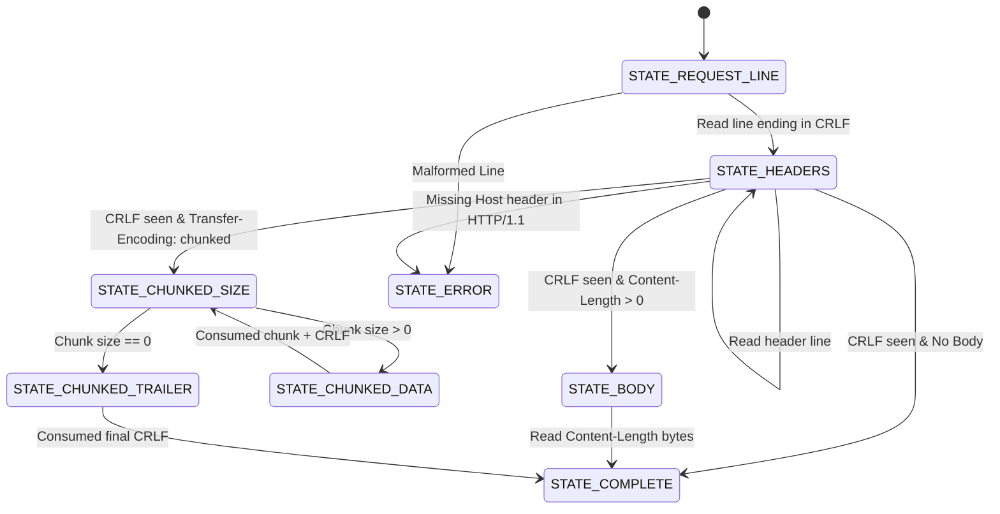
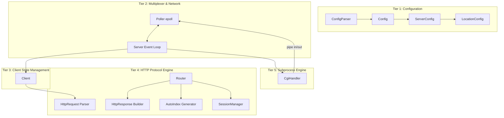

# The Definitive Guide to Building Webserv from Scratch

### _A Complete Architectural, Engineering, and Theoretical Manual for HTTP/1.1 Event-Driven Web Servers in C++98 (42 School Curriculum)_

---

## Table of Contents

1. [Introduction & Project Scope](#1-introduction--project-scope)
2. [Foundational POSIX Networking & I/O Multiplexing](#2-foundational-posix-networking--io-multiplexing)
   - [2.1 The BSD Socket API](#21-the-bsd-socket-api)
   - [2.2 Blocking vs Non-Blocking Sockets](#22-blocking-vs-non-blocking-sockets)
   - [2.3 The Single Event Loop (`epoll` Multiplexing)](#23-the-single-event-loop-epoll-multiplexing)
   - [2.4 Level-Triggered vs Edge-Triggered & The 100% CPU Spinning Trap](#24-level-triggered-vs-edge-triggered--the-100-cpu-spinning-trap)
   - [2.5 The 42 `errno` Rule & Simultaneous I/O](#25-the-42-errno-rule--simultaneous-io)
   - [2.6 Critical Signal Handling (`SIGPIPE`, `SIGINT`)](#26-critical-signal-handling-sigpipe-sigint)
3. [The HTTP/1.1 Protocol Engine (RFC 7230, RFC 2616)](#3-the-http11-protocol-engine-rfc-7230-rfc-2616)
   - [3.1 Structure of an HTTP Request](#31-structure-of-an-http-request)
   - [3.2 Streaming Parsing & The State Machine](#32-streaming-parsing--the-state-machine)
   - [3.3 RFC 7230 §5.4 Mandatory Host Header Validation](#33-rfc-7230-54-mandatory-host-header-validation)
   - [3.4 Body Delimitation: Content-Length vs Chunked Transfer-Encoding](#34-body-delimitation-content-length-vs-chunked-transfer-encoding)
   - [3.5 Streaming Chunked De-Chunker Implementation](#35-streaming-chunked-de-chunker-implementation)
   - [3.6 HTTP Response Serialization & Status Codes](#36-http-response-serialization--status-codes)
   - [3.7 Connection Management: Keep-Alive vs Close](#37-connection-management-keep-alive-vs-close)
4. [NGINX-Style Configuration System](#4-nginx-style-configuration-system)
   - [4.1 Lexer & Tokenizer](#41-lexer--tokenizer)
   - [4.2 Configuration Hierarchy: Server & Location Blocks](#42-configuration-hierarchy-server--location-blocks)
   - [4.3 URL Route Matching (Longest Prefix Match)](#43-url-route-matching-longest-prefix-match)
   - [4.4 Virtual Hosting (`server_name` Multiplexing)](#44-virtual-hosting-server_name-multiplexing)
5. [Router, Static Files, AutoIndex & Uploads](#5-router-static-files-autoindex--uploads)
   - [5.1 Path Resolution: `root` vs `alias` Semantics](#51-path-resolution-root-vs-alias-semantics)
   - [5.2 Security: Path Normalization & Directory Traversal Defense](#52-security-path-normalization--directory-traversal-defense)
   - [5.3 Static File Serving & MIME Types](#53-static-file-serving--mime-types)
   - [5.4 HTTP AutoIndex Generator](#54-http-autoindex-generator)
   - [5.5 File Uploads via Multipart/Form-Data & Raw Bodies](#55-file-uploads-via-multipartform-data--raw-bodies)
   - [5.6 File Deletion (`DELETE` Method)](#56-file-deletion-delete-method)
6. [Common Gateway Interface (CGI - RFC 3875)](#6-common-gateway-interface-cgi---rfc-3875)
   - [6.1 The CGI Execution Model](#61-the-cgi-execution-model)
   - [6.2 Non-Blocking IPC Pipes & Preventing Deadlocks](#62-non-blocking-ipc-pipes--preventing-deadlocks)
   - [6.3 Close-on-Exec (`FD_CLOEXEC`) on Parent Pipes](#63-close-on-exec-fd_cloexec-on-parent-pipes)
   - [6.4 Subprocess Forking, `dup2()`, and Directory Switching (`chdir`)](#64-subprocess-forking-dup2-and-directory-switching-chdir)
   - [6.5 RFC 3875 Environment Variables](#65-rfc-3875-environment-variables)
   - [6.6 CGI Timeout Management & Preventing Zombie Processes](#66-cgi-timeout-management--preventing-zombie-processes)
   - [6.7 Parsing CGI Output (Status & Custom Headers)](#67-parsing-cgi-output-status--custom-headers)
7. [Bonus Features: Multiple CGIs & Cookies / Sessions](#7-bonus-features-multiple-cgis--cookies--sessions)
   - [7.1 Multiple CGI Interpreters Dispatch](#71-multiple-cgi-interpreters-dispatch)
   - [7.2 Cookies in HTTP (`Cookie` and `Set-Cookie`)](#72-cookies-in-http-cookie-and-set-cookie)
   - [7.3 In-Memory `SessionManager` Implementation](#73-in-memory-sessionmanager-implementation)
   - [7.4 Session Lifecycle: Login, Authenticated Visits, Logout](#74-session-lifecycle-login-authenticated-visits-logout)
   - [7.5 Transparent CGI Cookie Integration (`HTTP_COOKIE`)](#75-transparent-cgi-cookie-integration-http_cookie)
8. [The 5-Tier System Architecture](#8-the-5-tier-system-architecture)
9. [Step-by-Step Implementation Roadmap](#9-step-by-step-implementation-roadmap)
10. [Testing, Benchmarking, and Evaluation Defense](#10-testing-benchmarking-and-evaluation-defense)

---

## 1. Introduction & Project Scope

Webserv is one of the foundational systems engineering milestones in the 42 curriculum. Its goal is to build a fully functional, event-driven HTTP/1.1 web server from scratch.

### Project Constraints

- **Language**: Pure C++98 standard (`-std=c++98 -Wall -Wextra -Werror -pedantic`).
- **Forbidden**: External libraries, Boost, thread pools / multithreading (`pthreads`, `std::thread`), `fork()` for anything other than CGI.
- **Single Event Loop**: All socket multiplexing (listeners, client connections, and CGI inter-process pipes) must operate on a single `poll()` or equivalent (`epoll` on Linux, `kqueue` on BSD/macOS).
- **Strictly Non-Blocking**: No read or write operation can block. Sockets and pipes must use non-blocking I/O.
- **No `errno` Checking**: You are strictly forbidden from checking `errno` after `read`, `write`, `recv`, or `send` to control server behavior.
- **Resilience**: Zero crashes, zero segmentation faults, zero unhandled exceptions, zero file descriptor leaks, and zero memory leaks under Valgrind.

---

## 2. Foundational POSIX Networking & I/O Multiplexing

### 2.1 The BSD Socket API

Every network interaction is based on file descriptors representing TCP stream sockets (`AF_INET, SOCK_STREAM`).

```
 Server Socket Flow:
 socket() -> setsockopt(SO_REUSEADDR) -> fcntl(O_NONBLOCK) -> bind() -> listen() -> accept()
```

#### Step 1: Create the Socket

```cpp
int listenFd = socket(AF_INET, SOCK_STREAM, 0);
if (listenFd < 0) throw std::runtime_error("socket() failed");
```

#### Step 2: Enable Address Reuse

When a server restarts, previous connections may linger in the `TIME_WAIT` TCP state. Without `SO_REUSEADDR`, `bind()` will fail with `Address already in use`.

```cpp
int opt = 1;
setsockopt(listenFd, SOL_SOCKET, SO_REUSEADDR, &opt, sizeof(opt));
```

#### Step 3: Set Non-Blocking Mode & Close-on-Exec

```cpp
fcntl(listenFd, F_SETFL, O_NONBLOCK);
fcntl(listenFd, F_SETFD, FD_CLOEXEC);
```

#### Step 4: Bind to Host and Port

```cpp
struct sockaddr_in addr;
std::memset(&addr, 0, sizeof(addr));
addr.sin_family = AF_INET;
addr.sin_port = htons(port); // Host to Network Short (endianness conversion)
addr.sin_addr.s_addr = (host == "0.0.0.0" || host.empty()) ? INADDR_ANY : inet_addr(host.c_str());

if (bind(listenFd, (struct sockaddr*)&addr, sizeof(addr)) < 0) {
    close(listenFd);
    throw std::runtime_error("bind() failed");
}
```

#### Step 5: Listen for Incoming Connections

```cpp
if (listen(listenFd, SOMAXCONN) < 0) {
    close(listenFd);
    throw std::runtime_error("listen() failed");
}
```

---

### 2.2 Blocking vs Non-Blocking Sockets

By default, sockets are blocking:

- If you call `recv()` on a blocking socket with no incoming data, the entire server process halts and sleeps until bytes arrive.
- If you call `send()` on a blocking socket and the operating system's TCP window is full, the server hangs until the client acknowledges packets.

In non-blocking mode (`O_NONBLOCK`):

- If no data is available, `recv()` returns `-1` immediately.
- If the send buffer is full, `send()` writes as many bytes as possible and returns immediately with the number of bytes written.

---

### 2.3 The Single Event Loop (`epoll` Multiplexing)

Instead of threads or processes per connection, a single multiplexer monitors hundreds or thousands of file descriptors simultaneously.

`epoll` is the Linux-native I/O multiplexer offering $O(1)$ event scalability (unlike `select` or `poll` which take $O(N)$):

1. **`epoll_create(int size)`**: Initializes an epoll kernel instance and returns an epoll file descriptor.
2. **`epoll_ctl(int epfd, int op, int fd, struct epoll_event *event)`**: Adds (`EPOLL_CTL_ADD`), modifies (`EPOLL_CTL_MOD`), or removes (`EPOLL_CTL_DEL`) monitored file descriptors.
3. **`epoll_wait(int epfd, struct epoll_event *events, int maxevents, int timeout)`**: Blocks until one or more monitored descriptors become ready for I/O or the timeout expires.

```cpp
int epollFd = epoll_create(1024);

// Register listening socket for incoming client connections (READ)
struct epoll_event ev;
ev.events = EPOLLIN;
ev.data.fd = listenFd;
epoll_ctl(epollFd, EPOLL_CTL_ADD, listenFd, &ev);
```

---

### 2.4 Level-Triggered vs Edge-Triggered & The 100% CPU Spinning Trap

Understanding how notification triggers work in `epoll` is the difference between an idle server taking 0% CPU vs a defective server burning 100% CPU:

#### The Behavior of Level-Triggered (LT) Mode (Default):

- `EPOLLIN` fires continuously as long as there is unread data in the kernel socket receive buffer.
- `EPOLLOUT` fires continuously as long as there is space in the kernel socket send buffer.

#### ⚠️ The Fatal Mistake:

If you register a client socket for `EPOLLOUT` (`EVENT_WRITE`) when the client first connects or when you have nothing to send, **the TCP send buffer is almost always empty and ready for write**.
Therefore, `epoll_wait()` will **never sleep**! It returns immediately with `EPOLLOUT` on every iteration, causing your server to spin in a 100% CPU busy-loop.

#### The Correct Event Loop Pattern:

1. When a client connects: Register for **`EVENT_READ` only**.
2. When the server finishes processing a request and builds the HTTP response: Register/modify the socket to **`EVENT_READ | EVENT_WRITE`**.
3. In `handleClientWrite`: Call `send()`. Consume the sent bytes from the client's internal write buffer.
4. Once the write buffer is completely flushed:
   - If `Connection: close`, close the socket.
   - If `Connection: keep-alive`, modify the epoll mask **back to `EVENT_READ`**.
   - The server immediately drops back to **0.0% CPU** while waiting for the next request.

---

### 2.5 The 42 `errno` Rule & Simultaneous I/O

The subject explicitly specifies:

> _"Checking the value of errno to adjust the server behaviour is strictly forbidden after performing a read or write operation."_
> _"poll() (or equivalent) must monitor both reading and writing simultaneously."_

#### How to comply strictly:

- Do NOT write: `if (bytesRead < 0 && errno == EAGAIN) ...`
- Rely entirely on `epoll_wait` readiness!
- If `epoll_wait` reported read readiness, call `recv()`. If `bytesRead <= 0`, it indicates a closed connection or disconnect; immediately close and clean up the client.
- If `epoll_wait` reported write readiness, call `send()`. If `bytesSent <= 0`, client closed the connection; immediately close.

---

### 2.6 Critical Signal Handling (`SIGPIPE`, `SIGINT`)

When a client suddenly disconnects (e.g. user closes browser tab or terminates `curl`), calling `write()` or `send()` on the dead socket will cause the Linux kernel to send `SIGPIPE` to your process.
**By default, `SIGPIPE` instantly terminates the server without any stack trace.**

To prevent server termination:

```cpp
// In main.cpp before starting the event loop:
signal(SIGPIPE, SIG_IGN); // Ignore SIGPIPE; send() will return -1 safely instead of crashing
signal(SIGINT, handleSignal);  // Graceful shutdown on Ctrl+C
signal(SIGTERM, handleSignal); // Graceful shutdown on systemd/kill
```

---

## 3. The HTTP/1.1 Protocol Engine (RFC 7230, RFC 2616)

### 3.1 Structure of an HTTP Request

An HTTP message consists of three distinct parts separated by CRLF (`\r\n`):

```http
GET /uploads/test.txt HTTP/1.1\r\n           <-- Request-Line (Method SP Request-Target SP Version)
Host: localhost:8080\r\n                     <-- Header Field
User-Agent: curl/7.81.0\r\n                  <-- Header Field
Connection: keep-alive\r\n                   <-- Header Field
\r\n                                         <-- Empty line delimiting headers from body
<body bytes here if Content-Length > 0>       <-- Message Body
```

---

### 3.2 Streaming Parsing & The State Machine

Because TCP is a stream-oriented protocol without message boundaries:

- A small request might arrive in a single `recv()` call.
- A large request or slow network connection might deliver bytes in small fragments across multiple event loop ticks.
- Multiple pipelined requests might arrive in one combined chunk.

You must maintain a per-client buffer and parse using a **Finite State Machine**:



---

### 3.3 RFC 7230 §5.4 Mandatory Host Header Validation

RFC 7230 §5.4 dictates:

> _"A server MUST respond with a 400 (Bad Request) status code to any HTTP/1.1 request message that lacks a Host header field..."_

When parsing finishes the headers section:

```cpp
if (m_version == "HTTP/1.1" && !hasHeader("host")) {
    m_errorCode = 400; // Bad Request
    m_state = STATE_ERROR;
    return true;
}
```

---

### 3.4 Body Delimitation: Content-Length vs Chunked Transfer-Encoding

HTTP provides two mechanisms to signal where a request body ends:

1. **`Content-Length: <N>`**: The body is exactly $N$ octets long.
2. **`Transfer-Encoding: chunked`**: Used when the sender does not know the total size in advance (e.g. streaming file uploads or dynamic pipes).
3. **Precedence**: RFC 7230 specifies that if both headers are present, `Transfer-Encoding` overrides `Content-Length`.

---

### 3.5 Streaming Chunked De-Chunker Implementation

A chunked body stream consists of zero or more chunks, followed by a terminating chunk of size 0:

```
4\r\n        <- Chunk size in hexadecimal (4 bytes)
Wiki\r\n     <- Chunk data (4 bytes) + trailing CRLF
6\r\n        <- Chunk size (6 bytes)
pedia \r\n   <- Chunk data (6 bytes) + trailing CRLF
0\r\n        <- Final chunk (size 0)
\r\n         <- Final CRLF
```

De-chunking logic:

```cpp
// 1. Read hex line up to \r\n
size_t crlf = m_rawBuffer.find("\r\n");
std::string line = m_rawBuffer.substr(0, crlf);
m_rawBuffer.erase(0, crlf + 2);

// Strip chunk extensions if any (e.g., "1a;name=val")
size_t semi = line.find(';');
if (semi != std::string::npos) line = line.substr(0, semi);

long chunkSize = std::strtol(line.c_str(), NULL, 16);
if (chunkSize == 0) {
    m_state = STATE_CHUNKED_TRAILER; // End of chunks
} else {
    // 2. Wait until m_rawBuffer has (chunkSize + 2) bytes
    m_body.append(m_rawBuffer, 0, chunkSize);
    m_rawBuffer.erase(0, chunkSize + 2); // Discard data and trailing \r\n
}
```

---

### 3.6 HTTP Response Serialization & Status Codes

Every HTTP response conforms to:

```http
HTTP/1.1 200 OK\r\n
Server: Webserv/1.0\r\n
Date: Fri, 04 Sep 2026 14:00:00 GMT\r\n
Content-Type: text/html\r\n
Content-Length: 42\r\n
Connection: keep-alive\r\n
\r\n
<html><body><h1>Hello 42!</h1></body></html>
```

Essential Status Codes:

- `200 OK`: Successful standard response.
- `201 Created`: Resource successfully created (file upload).
- `204 No Content`: Successful action with no body (file delete).
- `301 Moved Permanently`: Permanent URL redirection (`Location: /target`).
- `400 Bad Request`: Malformed HTTP syntax, missing Host header.
- `403 Forbidden`: Permission denied or directory without autoindex.
- `404 Not Found`: File or location does not exist.
- `405 Method Not Allowed`: Method not permitted by route config.
- `413 Payload Too Large`: Request body exceeds `client_max_body_size`.
- `500 Internal Server Error`: Server failure / process crash.
- `502 Bad Gateway`: CGI execution error or invalid output.
- `504 Gateway Timeout`: CGI process exceeded timeout (e.g. 5s).
- `505 HTTP Version Not Supported`: Client used HTTP/2 or HTTP/3.

---

### 3.7 Connection Management: Keep-Alive vs Close

- **HTTP/1.1**: Default is persistent (`keep-alive`). A connection stays open for subsequent requests unless `Connection: close` is specified.
- **HTTP/1.0**: Default is non-persistent (`close`). Keeps open only if `Connection: keep-alive` is specified.
- **Error Responses (4xx/5xx)**: Always attach `Connection: close` and disconnect the client after sending the error response to prevent stream corruption from remaining unread bytes.

---

## 4. NGINX-Style Configuration System

### 4.1 Lexer & Tokenizer

The configuration file is parsed by tokenizing on whitespace, semicolons (`;`), and braces (`{` and `}`), while ignoring `#` comments:

```cpp
std::vector<std::string> tokens = tokenize(configFileContent);
```

---

### 4.2 Configuration Hierarchy: Server & Location Blocks

```nginx
server {
    listen 8080;
    host 127.0.0.1;
    server_name localhost webserv.local;
    client_max_body_size 10M;
    root ./www;
    index index.html;

    error_page 404 /errors/404.html;

    location / {
        allow_methods GET POST;
        autoindex on;
    }

    location /uploads {
        allow_methods GET POST DELETE;
        root ./www/uploads;
        upload_enable on;
        upload_store ./www/uploads;
    }

    location /cgi-bin {
        allow_methods GET POST;
        root ./www/cgi-bin;
        cgi_ext .py /usr/bin/python3;
        cgi_ext .sh /bin/bash;
    }
}
```

---

### 4.3 URL Route Matching (Longest Prefix Match)

When a request for `/uploads/images/photo.png` arrives:

1. Iterate over all `location` blocks in the virtual host.
2. Find all locations that match the prefix of the URI.
3. Select the location with the **longest prefix match** (e.g. `/uploads` wins over `/`).
4. Ensure prefix matches happen at boundary slashes (e.g. `/uploads` matches `/uploads/file`, but does not match `/uploadstory`).

---

### 4.4 Virtual Hosting (`server_name` Multiplexing)

Multiple `server` blocks can listen on the **same interface and port** (e.g. `127.0.0.1:8080`):

1. The server creates **one** listening socket per unique `host:port` pair.
2. When a client connects, assign the first server block on that port as the default.
3. When the HTTP request arrives, inspect the `Host:` header (`Host: site-b.local:8080`).
4. Look up the matching `server` block whose `server_name` contains `site-b.local`.
5. Route the request using that virtual host's configuration!

---

## 5. Router, Static Files, AutoIndex & Uploads

### 5.1 Path Resolution: `root` vs `alias` Semantics

In standard NGINX and 42 specifications:

- `root`: Replaces the root prefix with the configured root directory.
  - Location: `/uploads`, Root: `./www/uploads`
  - URI: `/uploads/test.txt` $\to$ Rel: `test.txt` $\to$ Path: `./www/uploads/test.txt`.

---

### 5.2 Security: Path Normalization & Directory Traversal Defense

An attacker may send `GET /uploads/../../../../etc/passwd HTTP/1.1`.
If resolved naively, this leaks sensitive system files.

**Path Normalization Algorithm**:

1. Split URI by `/`.
2. Push components into a vector, ignoring empty components and `.`.
3. If component is `..`, pop the top element from the vector (never pop above root `/`).
4. Reconstruct the clean path. `/../../etc/passwd` becomes `/etc/passwd`.
5. Resolved relative to `./www`, it maps safely to `./www/etc/passwd` (which does not exist $\to$ 404 Not Found).

---

### 5.3 Static File Serving & MIME Types

Serve files using standard file I/O (`std::ifstream` in binary mode `ios::binary`).
Inspect file extension and attach the corresponding `Content-Type`:

- `.html` $\to$ `text/html`
- `.css` $\to$ `text/css`
- `.js` $\to$ `application/javascript`
- `.png` $\to$ `image/png`
- `.jpg` $\to$ `image/jpeg`
- Fallback $\to$ `application/octet-stream`

---

### 5.4 HTTP AutoIndex Generator

If a requested URI is a directory and has no `index` file:

1. Check if `autoindex on;` is enabled.
2. If disabled $\to$ return `403 Forbidden`.
3. If enabled $\to$ open directory with `opendir()` and read entries with `readdir()`.
4. Stat each entry (`stat()`) to obtain modification time and file size.
5. Sort entries: directories first, then alphabetical.
6. Render an HTML table containing links, modification dates, and sizes.

---

### 5.5 File Uploads via Multipart/Form-Data & Raw Bodies

For file uploads via `POST`:

1. Check `upload_enable on;`. If not enabled $\to$ `403 Forbidden`.
2. Inspect `Content-Type`:
   - If `multipart/form-data; boundary=----XYZ`: Extract the boundary, parse headers inside the multipart body, extract `filename="..."`, and extract the raw file bytes between boundaries.
   - If raw binary (`application/octet-stream` or text): Extract filename from request URI.
3. Sanitize filename (`filename.find_last_of("/\\")`) to prevent directory traversal.
4. Save file to `upload_store` directory using binary `std::ofstream`.
5. Return `201 Created` with a `Location:` header pointing to the new resource.

---

### 5.6 File Deletion (`DELETE` Method)

When a `DELETE /uploads/file.txt` arrives:

1. Verify file exists with `stat()`. If not $\to$ `404 Not Found`.
2. If path is a directory $\to$ return `403 Forbidden` (refuse directory deletion).
3. Call `unlink(fullPath.c_str())`.
4. If successful $\to$ return `204 No Content`.

---

## 6. Common Gateway Interface (CGI - RFC 3875)

### 6.1 The CGI Execution Model

CGI allows the server to run external executables (Python, Bash, PHP, Perl, compiled binaries) to generate dynamic content.

```
 Client ---- (HTTP POST) ----> Webserv
                                 |
                          fork() & pipe()
                                 |
                                 v
                            CGI Subprocess (Python/Bash)
                                 |
                                 v
 Webserv <--- (CGI Output) ------+
```

---

### 6.2 Non-Blocking IPC Pipes & Preventing Deadlocks

Communication requires two pipes:

1. `inPipe[2]`: Parent writes request body $\to$ Child reads from stdin.
2. `outPipe[2]`: Child writes stdout $\to$ Parent reads CGI response.

#### ⚠️ The Deadlock Trap:

If a client sends a 2MB upload to a CGI script:

- If the server attempts to write the entire 2MB to `inPipe[1]` in a blocking loop before reading from `outPipe[0]`:
- The OS pipe buffer (typically 64KB) fills up! The parent blocks waiting for the child to read.
- Simultaneously, the child starts producing output and fills `outPipe[1]`. The child blocks waiting for the parent to read.
- **Both processes hang forever in a circular deadlock!**

#### The Solution:

Multiplex both pipe descriptors in the **same event loop**:

- Parent end `inPipe[1]` is registered in `epoll` with `EVENT_WRITE`.
- Parent end `outPipe[0]` is registered in `epoll` with `EVENT_READ`.
- As the child consumes input, the parent writes chunks. As the child produces output, the parent reads chunks.

---

### 6.3 Close-on-Exec (`FD_CLOEXEC`) on Parent Pipes

When `fork()` is called, all open file descriptors in the parent are cloned into the child.
If client A triggers a CGI script, and while it is running, client B triggers another CGI script:

- Client B's child process inherits open file descriptors of client A's pipes!
- As a result, client A's pipe will **never receive EOF**, even when parent closes it.

**Fix**: Always set `FD_CLOEXEC` on both parent pipe ends immediately after creating them:

```cpp
fcntl(inPipe[1], F_SETFD, FD_CLOEXEC);
fcntl(outPipe[0], F_SETFD, FD_CLOEXEC);
```

---

### 6.4 Subprocess Forking, `dup2()`, and Directory Switching (`chdir`)

Inside the child process (`pid == 0`):

```cpp
// Redirect standard input and standard output to pipes
dup2(inPipe[0], STDIN_FILENO);
dup2(outPipe[1], STDOUT_FILENO);

// Close all original pipe descriptors
close(inPipe[0]); close(inPipe[1]);
close(outPipe[0]); close(outPipe[1]);

// Change directory to the script's directory so relative paths work (RFC 3875 requirement)
chdir(scriptDirectory.c_str());

// Execute the interpreter
execve(interpreterPath.c_str(), argv, envp);
std::exit(1); // Exit if execve fails
```

---

### 6.5 RFC 3875 Environment Variables

CGI scripts receive request parameters through standard environment variables (`envp`):

- `REQUEST_METHOD`: `GET`, `POST`, etc.
- `REQUEST_URI`: Full URI requested by the client.
- `SCRIPT_NAME`: Virtual path to the script (`/cgi-bin/hello.py`).
- `SCRIPT_FILENAME`: Filesystem path to the script (`./www/cgi-bin/hello.py`).
- `QUERY_STRING`: Everything after `?` in the URI (`name=42&val=100`).
- `CONTENT_LENGTH`: Size of the body in bytes.
- `CONTENT_TYPE`: MIME type of the body (e.g. `application/x-www-form-urlencoded`).
- `REMOTE_ADDR`: Client IP address.
- `SERVER_NAME` / `SERVER_PORT`: Virtual host server name and port.
- `GATEWAY_INTERFACE`: `CGI/1.1`
- `SERVER_PROTOCOL`: `HTTP/1.1`
- `HTTP_*`: All HTTP request headers mapped to uppercase with hyphens converted to underscores (e.g. `User-Agent` $\to$ `HTTP_USER_AGENT`, `Cookie` $\to$ `HTTP_COOKIE`).

---

### 6.6 CGI Timeout Management & Preventing Zombie Processes

A CGI script may contain an infinite loop (`while True: pass`). The server must not hang indefinitely.

#### 1. Timeout Kill (e.g. 5 seconds)

In `checkTimeouts()`:

```cpp
if (now - cgi->getStartTime() > 5) {
    kill(cgi->getPid(), SIGKILL);
    int status;
    waitpid(cgi->getPid(), &status, 0); // Reaps child immediately
    // Send 504 Gateway Timeout to client
}
```

#### 2. Zombie Process Prevention (`<defunct>`)

If you only call `waitpid(..., WNOHANG)` immediately after `kill()`, the asynchronous signal delivery may not have finished transitioning the process. The process dies a millisecond later and becomes a permanent `<defunct>` zombie!

**The Golden Rule**:

1. After `kill(pid, SIGKILL)`, call synchronous `waitpid(pid, &status, 0)` because `SIGKILL` cannot be caught and terminates instantly.
2. In the periodic event loop timeout check, call a non-blocking reaper loop:

```cpp
int status;
while (waitpid(-1, &status, WNOHANG) > 0);
```

---

### 6.7 Parsing CGI Output (Status & Custom Headers)

CGI scripts output their own HTTP headers separated from the body by `\r\n\r\n` or `\n\n`:

```http
Status: 200 OK\r\n
Content-Type: text/html\r\n
Set-Cookie: user=42; Path=/\r\n
\r\n
<html><body>Hello from CGI!</body></html>
```

1. Read until EOF (`read() == 0`).
2. Search for the delimiter `\r\n\r\n` or `\n\n`.
3. Parse headers line by line.
4. Extract `Status:` if present to set the HTTP status code.
5. Forward all custom headers (including `Set-Cookie`) to the client response.

---

## 7. Bonus Features: Multiple CGIs & Cookies / Sessions

### 7.1 Multiple CGI Interpreters Dispatch

Configure interpreters by file extension in `default.conf`:

```nginx
location /cgi-bin {
    cgi_ext .py /usr/bin/python3;
    cgi_ext .sh /bin/bash;
    cgi_ext .php /usr/bin/php-cgi;
}
```

In `Router::isCgiRequest()`, extract `getFileExtension(path)`. If it matches any key in `loc->cgi_handlers`, route the request to `CgiHandler` with the designated interpreter.

---

### 7.2 Cookies in HTTP (`Cookie` and `Set-Cookie`)

1. **Client $\to$ Server (`Cookie` header)**:
   ```http
   Cookie: session_id=sess_6a9adb7d_0001; theme=dark
   ```
2. **Server $\to$ Client (`Set-Cookie` header)**:
   ```http
   Set-Cookie: session_id=sess_6a9adb7d_0001; Path=/; Max-Age=3600; HttpOnly; SameSite=Lax
   ```

---

### 7.3 In-Memory `SessionManager` Implementation

```cpp
struct Session {
    std::string id;
    std::string username;
    int visitCount;
    time_t createdAt;
    time_t lastAccessed;
};

class SessionManager {
public:
    static Session* createSession(const std::string& username);
    static Session* getSession(const std::string& sessionId);
    static bool destroySession(const std::string& sessionId);
    static void cleanupExpired(time_t maxAgeSeconds = 3600);
private:
    static std::map<std::string, Session> s_sessions;
};
```

---

### 7.4 Session Lifecycle: Login, Authenticated Visits, Logout

- **Login (`POST /api/session/login`)**:
  Accepts username, generates unique session token, registers session in `SessionManager`, and attaches:
  `Set-Cookie: session_id=<id>; Path=/; Max-Age=3600; HttpOnly`.
- **Authenticated Request (`GET /api/session`)**:
  Reads `request.getCookie("session_id")`. Looks up session. Increments `session->visitCount`. Returns JSON `{ "active": true, "username": "...", "visits": N }`.
- **Logout (`POST /api/session/logout`)**:
  Deletes session from memory. Invalidates browser cookie by returning:
  `Set-Cookie: session_id=; Path=/; Max-Age=0`.

---

### 7.5 Transparent CGI Cookie Integration (`HTTP_COOKIE`)

All incoming headers are passed into `envp` as `HTTP_*`.
Therefore, `Cookie: cgi_visits=1` is automatically passed to CGI scripts as:

```bash
HTTP_COOKIE="cgi_visits=1"
```

And any `Set-Cookie` printed by the CGI script is forwarded directly to the HTTP response.

---

## 8. The 5-Tier System Architecture



---

## 9. Step-by-Step Implementation Roadmap

| Phase | Milestone                             | Core Deliverables                                                                                                                        |
| :---: | :------------------------------------ | :--------------------------------------------------------------------------------------------------------------------------------------- |
| **1** | **Configuration Parser**              | Lexer, token parsing, `ServerConfig`, `LocationConfig`, IP/port extraction, default fallback values.                                     |
| **2** | **Poller & Event Loop**               | `epoll` wrapper class (`addFd`, `modifyFd`, `removeFd`, `pollEvents`), listening sockets with `SO_REUSEADDR` and `O_NONBLOCK`.           |
| **3** | **Client I/O & Connection Lifecycle** | `accept()` new clients, non-blocking `recv()` and `send()`, dynamic `EPOLLOUT` toggling, inactivity timeouts.                            |
| **4** | **HTTP Protocol Engine**              | Streaming `HttpRequest` state machine, chunked un-chunker, RFC 7230 Host header check, `HttpResponse` serializer.                        |
| **5** | **Static Routing & File Ops**         | Longest prefix location match, path normalization, MIME lookup, directory index, `AutoIndex` generator, multipart file upload, `DELETE`. |
| **6** | **CGI Subprocess Integration**        | Non-blocking pipes, `FD_CLOEXEC`, `fork()`, `dup2()`, `chdir()`, `envp` generation, 5s timeout kill, `<defunct>` zombie reaping.         |
| **7** | **Bonus Part**                        | Dynamic multi-CGI dispatch (`.py`, `.sh`), cookie parsing, in-memory `SessionManager`, `Set-Cookie` generation, web UI demo.             |
| **8** | **Hardening & Defense Prep**          | Valgrind verification (0 leaks), `siege` stress benchmarking (10,000+ req/s), integration test harness (`test_server.py`).               |

---

## 10. Testing, Benchmarking, and Evaluation Defense

### 10.1 Automated Integration Testing

Write an automated test harness in Python (`tests/test_server.py`) using raw sockets to test every corner case:

- Chunked transfer streaming
- Missing `Host` header (verifying 400 Bad Request)
- Malformed request lines (verifying 400 Bad Request)
- Inactivity timeouts
- CGI 5-second timeout (verifying 504 Gateway Timeout)
- Zombie process verification (`ps -ef | grep "<defunct>"`)
- File uploads, downloads, and deletions

### 10.2 Stress Testing with `siege`

Evaluate throughput and resilience under high concurrency:

```bash
siege -b -c 25 -t 10s http://127.0.0.1:8080/
```

Target: **100.00% availability**, 0 failed transactions, transaction rate > 5,000 trans/sec.

### 10.3 Valgrind Memory Checking

Ensure clean memory lifecycle under signal termination and stress:

```bash
valgrind --leak-check=full --show-leak-kinds=all ./webserv conf/default.conf
```

Target: `All heap blocks were freed -- no leaks are possible`.

---

_Authored for the 42 Network Webserv Project._
