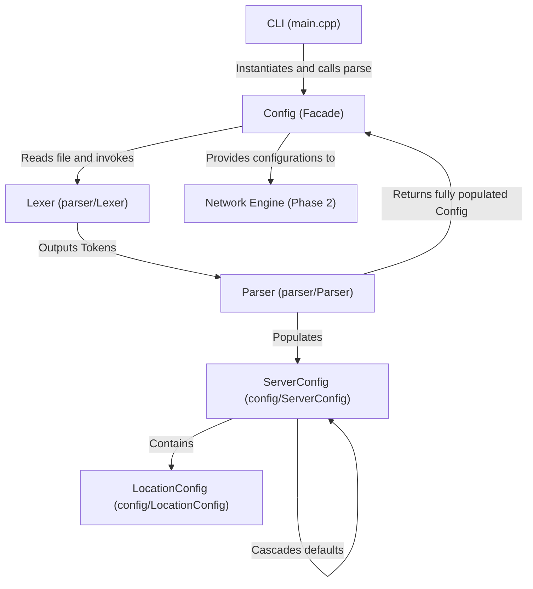
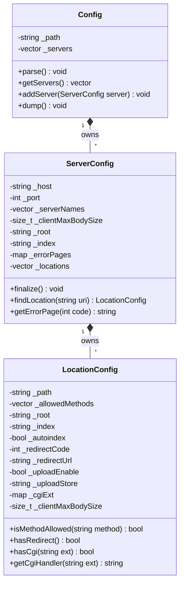
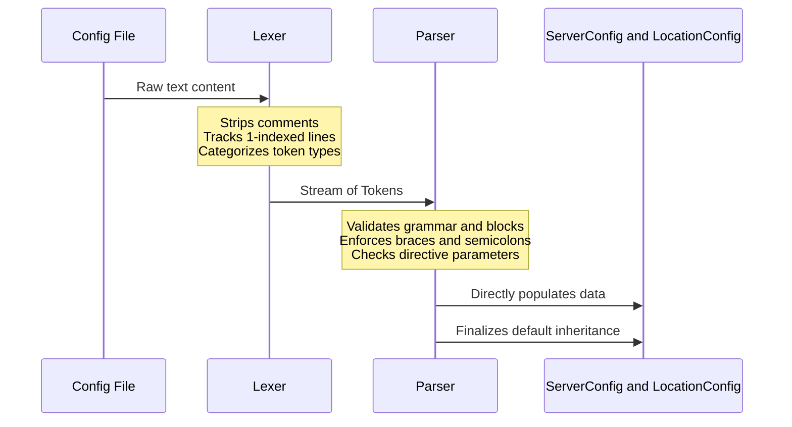
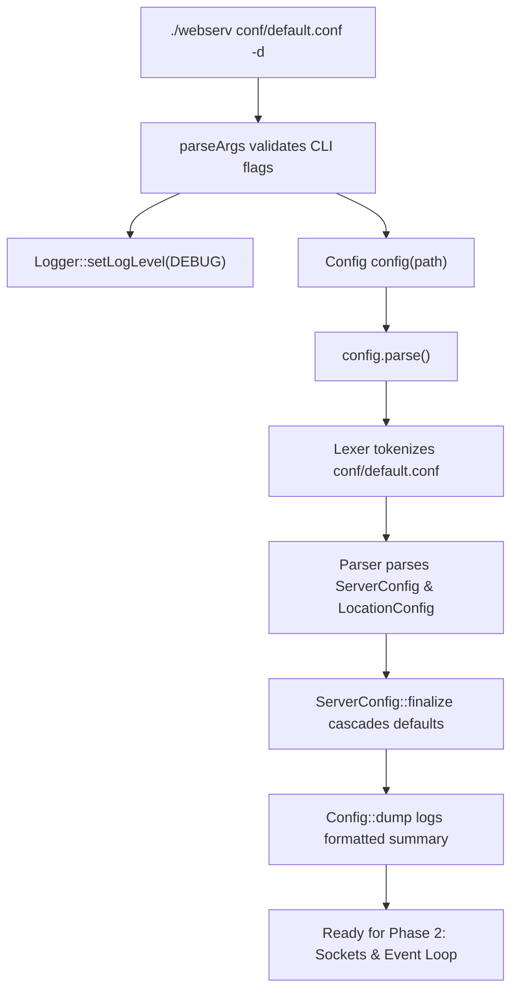
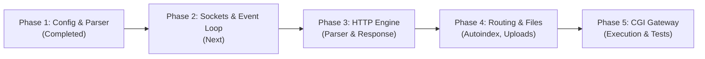

# Webserv Architecture & Project Design

> **Project:** 42 School Webserv (HTTP/1.1 Server in C++98)  
> **Status:** Phase 1 (Configuration & Parsing Subsystem) Complete  
> **Standard:** C++98 Orthodox Canonical Form (OCF), `-Wall -Wextra -Werror -pedantic`

---

## Table of Contents

1. [Project Overview](#1-project-overview)
2. [Architectural Overview](#2-architectural-overview)
3. [Directory & Subsystem Structure](#3-directory--subsystem-structure)
4. [Data Structures Design](#4-data-structures-design)
5. [Lexer & Parser Logic](#5-lexer--parser-logic)
6. [Data Flow & Execution Lifecycle](#6-data-flow--execution-lifecycle)
7. [Current Progress & Verification](#7-current-progress--verification)
8. [Next Steps (Roadmap)](#8-next-steps-roadmap)

---

## 1. Project Overview

Webserv is an RFC 7230–7235 compliant HTTP/1.1 web server written in **C++98** from scratch. The server is designed to:

- Be fully **non-blocking** and event-driven using an I/O multiplexer (`poll`, `epoll`, or `kqueue`).
- Support **virtual hosts** (matching requests by port, IP, and the `Host` header).
- Serve **static content**, manage **file uploads**, and generate dynamic **directory listings (autoindex)**.
- Handle **HTTP redirection** (e.g. 301, 302).
- Execute dynamic scripts via a **CGI gateway** (e.g. Python, Bash, PHP).

---

## 2. Architectural Overview

The server is decoupled into clean, modular subsystems following the **Separation of Concerns (SoC)** and **Single Responsibility Principle (SRP)**:



---

## 3. Directory & Subsystem Structure

The codebase is organized into explicit domain modules under `include/` and `src/`:

```text
webserv/
├── conf/
│   └── default.conf          # NGINX-style configuration file
├── include/
│   ├── config/
│   │   ├── Config.hpp         # Root configuration facade
│   │   ├── LocationConfig.hpp # Route/Location rule model
│   │   └── ServerConfig.hpp   # Virtual server model
│   ├── parser/
│   │   ├── Lexer.hpp          # Character scanner & token stream
│   │   └── Parser.hpp         # Recursive-descent grammar parser
│   └── utils/
│       ├── Logger.hpp         # Thread-safe leveled logger (DEBUG, INFO, etc.)
│       └── Utils.hpp          # Type conversions, string & size helpers
├── src/
│   ├── config/
│   │   ├── Config.cpp
│   │   ├── LocationConfig.cpp
│   │   └── ServerConfig.cpp
│   ├── parser/
│   │   ├── Lexer.cpp
│   │   └── Parser.cpp
│   ├── utils/
│   │   ├── Logger.cpp
│   │   └── Utils.cpp
│   └── main.cpp               # Entry point & argument validation
├── Makefile                   # Strict C++98 build with automatic dependency tracking (-MMD -MP)
└── ARCHITECTURE.md            # Comprehensive project documentation
```

---

## 4. Data Structures Design

All classes adhere strictly to **C++98 Orthodox Canonical Form (OCF)** (Default Constructor, Copy Constructor, Assignment Operator, Destructor) and ensure const-correctness.



### Data Class Roles

1. **`Config`**:
   - Acts as the public facade for the entire configuration subsystem.
   - Hides internal parsing machinery from `main.cpp`.
   - Provides `dump()` for structured debugging output with grouped error pages.

2. **`ServerConfig`**:
   - Represents a single virtual host (`server { ... }`).
   - Manages socket bind parameters: `_host` (default `127.0.0.1`) and `_port` (default `8080`).
   - `finalize()`: Cascades server-level defaults down into child locations.
   - `findLocation(uri)`: Longest prefix matching with path boundary validation.
   - `getErrorPage(code)`: Error page lookup by HTTP status code.

3. **`LocationConfig`**:
   - Represents a route (`location <path> { ... }`).
   - Manages route-specific options: `allow_methods`, `root`, `index`, `autoindex`, `return`, `upload_store`, `cgi_ext`, `client_max_body_size`.
   - Domain helpers: `isMethodAllowed()`, `hasRedirect()`, `hasCgi()`, `getCgiHandler()`.

---

## 5. Lexer & Parser Logic

### The 2-Stage Separation

Instead of mixing character scanning and grammar parsing into one monolithic file:



1. **Lexical Analysis (`Lexer`)**:
   - Categorizes tokens into `TOKEN_WORD`, `TOKEN_LBRACE`, `TOKEN_RBRACE`, `TOKEN_SEMICOLON`.
   - Strips comments (`#`) and tracks 1-based line numbers.
2. **Syntactic Analysis (`Parser`)**:
   - Enforces block grammar (`server`, `location`).
   - `readDirective()` reads directive names and arguments directly without extra intermediate structures.
   - Validates ranges: port (1 to 65535), HTTP error codes (300 to 599), size multipliers (`10M` to bytes).

---

## 6. Data Flow & Execution Lifecycle



---

## 7. Current Progress & Verification

| Component                   |   Status    | Verification Result                                               |
| :-------------------------- | :---------: | :---------------------------------------------------------------- |
| **Lexer & Parser**          |  **Done**   | Correctly parses all 157 tokens across 64 lines in `default.conf` |
| **Data Models (OCF)**       |  **Done**   | Strict C++98 Orthodox Canonical Form                              |
| **Directive Inheritance**   |  **Done**   | Child locations inherit parent server root, index, and limits     |
| **Longest Prefix Matching** |  **Done**   | `findLocation()` routing with boundary checks                     |
| **CLI Validation**          |  **Done**   | Duplicate options (`-d -d`) and invalid flags rejected            |
| **Memory Safety**           | **0 Leaks** | Clean run under Valgrind (913 allocs, 913 frees, 0 errors)        |

---

## 8. Next Steps (Roadmap)



1. **Phase 2: Network Subsystem & Event Loop**:
   - Create `Socket` class (socket creation, `fcntl(O_NONBLOCK)`, `setsockopt(SO_REUSEADDR)`, `bind`, `listen`).
   - Instantiate listening sockets for each unique `host:port` combination in `Config`.
   - Implement the non-blocking I/O event loop (`poll` / `epoll` / `kqueue`).
2. **Phase 3: HTTP Protocol Engine**:
   - Implement streaming `HttpRequest` parser (request line, headers, chunked body).
   - Implement `HttpResponse` generator (headers, MIME types, status lines).
3. **Phase 4: Routing & Static Operations**:
   - Connect incoming requests to matching `ServerConfig` and `LocationConfig`.
   - Handle directory listing (`autoindex on`), file uploads (`POST`), and deletions (`DELETE`).
4. **Phase 5: CGI Gateway**:
   - Execute scripts asynchronously with fork, pipes, environment variables (`PATH_INFO`, `QUERY_STRING`), and execution timeouts.
